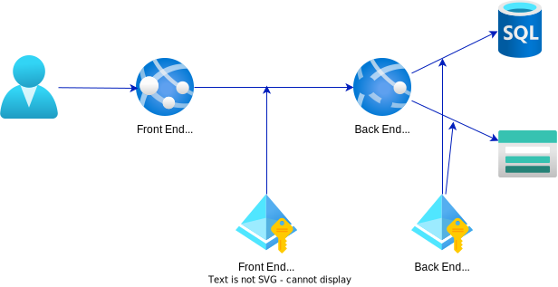

# Service to service Authentication with Managed Identity

## The Use case



The concept is that we have some kind of front-end service that can be accessed by external users or systems. We then have a separate "Back End API" which should *only* be accessed by the Front End service and never by any users or any other service. *This example is obviously simplified. In real-world scenarios there will be more parts and more reasons to do something like this*. 

You should, obviously, also use network isolation to restrict traffic to the Back End. In high-security scenarios, the network isolation is not enough and you will want inter-service authentication *as well*. 

What we are trying to do here is add authentication to the Back End API so we can restrict access to *only* the Front End in the simplest way possible. There are lots of ways we can do this in code, but the aim here is to use as much built-in Azure functionality as possible and make as few code changes as possible.


## Managed Identity
Azure has the amazing concept of Managed Identity, which allows you to let Azure manage a "user" for each of your Azure services or VMs and use that "user" to access Azure resources.
The way this is implemented means you no longer have to use secrets or passwords to authenticate to, say, a database. Your app can login to the database "as itself" without needing to know a password at all.

Wouldn't it be amazing if you could also use this approach to do service-to-service authentiation between your own services? What if you could specify "allow this web server to access this API" declaratively, in the same way you say "allow this web server to access this storage account".

Well, you can. It's just a lot harder than it should be, unfortunately. In this post I will explain how you can set this up, today.

For the purposes of this conversation and the code in this repository, we have the following:
- A web called "Back End". We are going to protect this so you need to present an authentication token for it to respond.
- A web app called "Front End". This will call the Backend, using Managed Identity.
- A "Tester" console app you can use locally as an alternative to "Front End", if you like.

This approach will use Azure Managed Identity on the "Front End" service and use App Service Authentication on the "Back End". The benefit of this approach is that you do not need any code at all on the Back End - it's all handled before the request even reaches your code.
You could, instead, implement authentication inside the Back End application. That is an entirely valid approach and the choice between the two methods depends on your particular circumstances.

## The simple approach
[This post](https://awh.net/blog/securing-api-to-api-azure-app-services-using-managed-identity) explains how to set this up using the portal. Some of the specifics have changed, but it's easy enough to follow.
The only thing is the "scope" parameter that will be different. In the example they use "https://your-integrationapi-url.azurewebsites.net/.default". That is no longer the default: If you follow the blog post, once you have set up authentication, following the link from the App Service Authentication to the App Registration. Then go to "Expose an API". At the top you will see something like "api://123". Take that value and append "./default" to end up with something like "api://123./default". 

**However** that approach will allow *any* user or Managed Identity in the tenant to successfully authenticate to your Service. That may be fine, depending on your requirements.

## But I want more
I want two more things:

1. I want to control exactly which Managed Identities can access my Service.
2. I want to set this up using Bicep so it is repeatable.

This repository has everything you need to set this up, including code to test it.

### Limiting which Managed Identities can access my Service
It should be pretty simple to control which users and managed identities can connect to your Service - right? When you look into this, it is rather more complicated. If you let the Azure App Service create the App Service Registration for you, it will have also created an Enterprise Application (which you don't actually need). When you have such an Enterprise Application, you can control which users can authenticate to the app by "switch of allow all" and then "add users". *Unfortunately* it is not possible to add a Managed Identity to the list of allowed users. This looks like a major oversight from Microsoft. If you "disable allow all", your Front End application will no longer be able to connect. Worse, you will get a 500 error, implying this is an unhandled scenario. 

Instead, the authentication setup for App Service Authentication has a `defaultAuthorizationPolicy` which can have an array of `allowedPrincipals`. You cannot access this is in the Azure Portal though! You have to deploy with ARM/Bicep tp get access to this - or do some manual editing using [Azure Resource Explorer](https://resources.azure.com/).

Wouldn't it be nice if we could add allowed users and managed identities directly in the Azure Portal or Bicep in a similar way to how you can allow a Managed Identity to access, say, a Storage Account using RBAC? Maybe one day...

Detailed steps below.

### I want to set this up using Bicep
To set up Authentication on an App Service using ARM or Bicep, you need to first create an App Registration. This is similar to Option 2 in [Microsoft's docs on how to set this up via the portal](https://learn.microsoft.com/en-us/azure/app-service/configure-authentication-provider-aad?tabs=workforce-tenant#-option-2-use-an-existing-registration-created-separately).

Alas, it is not possible to create an App Registration through ARM/Bicep for some reason so you have to do it manually or use Powershell (this seems to be by design, somehow, because it's a Tenant thing but that doesn't make sense to me, given how it is used).

Detailed steps below.

## Key concepts

### App Registration and Authentication

In order for a an App Service to have "Authentication" (the built-in type) it needs an App Registration created in the Tenant. When you set up Authentication in the portal, an App Registration is automatically created for you. This will also create an Enterprise Application (i.e. an associated Service Principal), set up an API Permission and create a Secret and store this in a config setting on the App Service. You only need the App Registration to make the inbound authentication work - the other things are unnecessary if you just want to handle inbound auth.

The concept of App Registrations is extremely broad and could probably fill a whole book and I won't attempt to explain it here. Note that what I am describing here almost certainly won't work cross-tenant; you can absolutely set that up, but it requires more work.

### Managed Identity and Principals
A *Principal* in Azure AD is any kind of "user" in that Azure AD Tenant.
A *Service Principal* is specifically a "user" that is really an application and not a person. 
*Managed Identity* is a kind of Service Principal. They can be "System assigned" or "User Managed", but in either case they are linked to either a specific Azure resource or at least a Resource group. For many purposes they can be treated just like an ordinary user; You can give a Managed Identity Azure RBAC roles and give it access to different things. Unfortunately, for some odd reason, you cannot give a Managed Identity "user" access to an Enterprise Application (i.e. for the purposes of App Service Authentication). Because a Managed Identity does *not* have an associated App Registration, it also does not have a Client ID. This is a shame, because it is also possible to give specific Application Client IDs access to an App Registration and thus allow access through the App Service Registration.

There is a *lot* more that can be said to explain all of this, but that is outside the scope of this post. It is a big, complicated, topic and worth learning about but you can get by without knowing it all for the purposes of what we are doing today.

## Setting up the authentication

### Creating the App Registration
There is a way to [create an App Registration by embedding Powershell inside a Bicep template](https://reginbald.medium.com/creating-app-registration-with-arm-bicep-b1d48a287abb). However, that comes with its own challenges so I am avoding that approach here.

Instead, you need to run some Powershell to create the App Registration and then copy the ID and the Application ID URI (you can get them later from the portal, don't worry).

The script `CreateAppRegistration.ps1` will create the App Registration for you.
In the end, there is not a lot to it.

1. You need an "Application Identifier URI" - this is used for the Front End to request a token: When the Front End asks Azure for a token, it needs to specify a "Scope". The scope is the `[Application Identifier URI]/.default` - for example `api://1232343124/.default` or `api://mywebsite.something.com/.default`. It is important that the Application Identifier URI is unique within the tenant. You can see the current value on the "Expose an API" page of the App Registration.  
2. In the script, we also ask for the URL for the website. It is not entirely clear if this is actually necessary in this scenario, as we don't support "redirect URLs". 

And that's it. App Registrations have a *lot* of functionality, but this one uses hardly any of it and is very light-weight.

### Setting up Authentication with Bicep
The `main.bicep` file will set up the Authentication on the backend and add some configuration values to the Front End. The key bit is this:

```bicep
resource auth 'Microsoft.Web/sites/config@2022-09-01' = {
  parent: backEnd
  name: 'authsettingsV2'
  properties: {
    globalValidation: {
      requireAuthentication: true
      unauthenticatedClientAction: 'Return401'
    }
    identityProviders: {
      azureActiveDirectory: {
        registration: {
          clientId: backendAuthappRegistrationClientId
          openIdIssuer: 'https://sts.windows.net/${tenant().tenantId}/v2.0'
        }
        enabled: true
        login: {
          disableWWWAuthenticate: true
        }
        validation: {
          allowedAudiences: [
            backendAuthApplicationIDUri
          ]
          defaultAuthorizationPolicy: {
            allowedPrincipals: {
              identities: [
                frontEnd.identity.principalId
              ]
            }
          }
        }
      }
    }
  }
}

```

The `globalValidation` sets it up so all requests must be authenticated and configures it to return 401 (rather than a redirect to a login page) if not authenticated.

The `azureActiveDirectory/registration` needs the ID of the App Registration you created above: It kinda delegates authentication to the App Registration.

The `validation\allowedAudiences` is very important: If you forget it (or it's wrong) you will get 401 errors when trying to connect. If you experiment in the Portal, it is very easy to miss it as you are not asked for it - you have to dig down a level to get to it. It just needs the value of the "Application ID URI" from the "Expose an API" section of the App Registration.

`defaultAuthorizationPolicy\allowedPrincipals` is the reason we are here at all: This is how we can control which Managed Identities can access the service. When this is present, only the users listed here will be allowed access. Others will still be able to obtain a token, but they will receive a 40*3* (not a 401) if they try to access the Back End. You can list multiple Principals here. 


## Accessing the Service

The purpose of this exercise was to use Managed Identity, so first set up Managed Identity on the Front End. 

Once you have done that, you can use the following code:
```csharp
var client = new HttpClient();
var creds = new DefaultAzureCredential();
var token = await creds.GetTokenAsync(new Azure.Core.TokenRequestContext(new string[] { scope }));
client.DefaultRequestHeaders.Authorization = new AuthenticationHeaderValue("Bearer", token.Token);
var backendResponse = await client.GetAsync(backend);

```
*Not production code - don't new up HttpClient!*.
This code will use Managed Identity in Azure and your local user account when testing locally. 
It is almost surprisingly easy, once you get to this point.

Note that obtaining a token is an expensive, slow operation. You definitely want to cache the token! 

### Testing locally

When testing locally (use the "tester" program) there are few things to note:
1. When you call `DefaultAzureCredential`, it will use one of several local Azure Identity providers that you may have logged in with. In my case, that is the Azure CLI, but it doesn't have to be. The first time you do this, it will probably tell you that "this has not received Admin consent" and ask you to "login interactively". Once you do that, you may get an error saying that this Client ID has not been authorised for use with this App Service. Take a note of this Client ID and go to the App Registration in the Azure Portal, then to the "Expose an API" page and select "Add a client application".
The Client ID here is an application - in my case the Azure CLI - and not a user ID. It makes sense if you dig into oAuth, but - again - outside the scope of this post. I recommend that you only add this Client ID for testing and remove it in production.
2. You need to get your own user's Object ID and add it to `defaultAuthorizationPolicy\allowedPrincipals` - otherwise you will get a 403 when you try to connect. You can get your Object ID via the Azure CLI by running `az ad signed-in-user show`.
